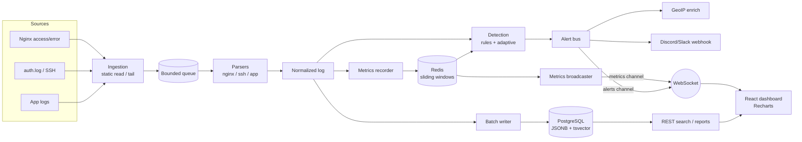

# Architecture

## Data flow

1. **Ingestion** reads each configured source either once (`static`) or by
   following it (`tail`), pushing raw lines into a bounded in-memory queue.
2. **Parsers** turn raw lines into a single normalized log schema shared by
   every source type.
3. **Storage** batches normalized logs into PostgreSQL, with a generated
   `tsvector` column for full-text search and JSONB for source-specific fields.
4. **Metrics** are maintained as Redis sorted-set sliding windows (request
   rate, status classes, per-IP hits, SSH failures).
5. **Detection** evaluates fixed-threshold rules and an adaptive
   moving-average / standard-deviation monitor over the same Redis windows.
6. **Alerts** are normalized, geolocated, stored, pushed to the dashboard over
   a dedicated WebSocket channel and optionally forwarded to a chat webhook.
7. **Dashboard** subscribes to the metrics and alerts channels and renders
   live charts with Recharts.

## Normalized log schema

| Field        | Description                                   |
| ------------ | --------------------------------------------- |
| `source`     | `nginx` \| `ssh` \| `app`                     |
| `timestamp`  | Event time (parsed from the source)           |
| `ip`         | Source IP when available                      |
| `level`      | `info` \| `warn` \| `error`                   |
| `eventType`  | e.g. `http_request`, `ssh_auth`, `app_log`    |
| `message`    | Human-readable message (indexed for search)   |
| `fields`     | Source-specific structured data (JSONB)       |
| `raw`        | Original log line                             |
